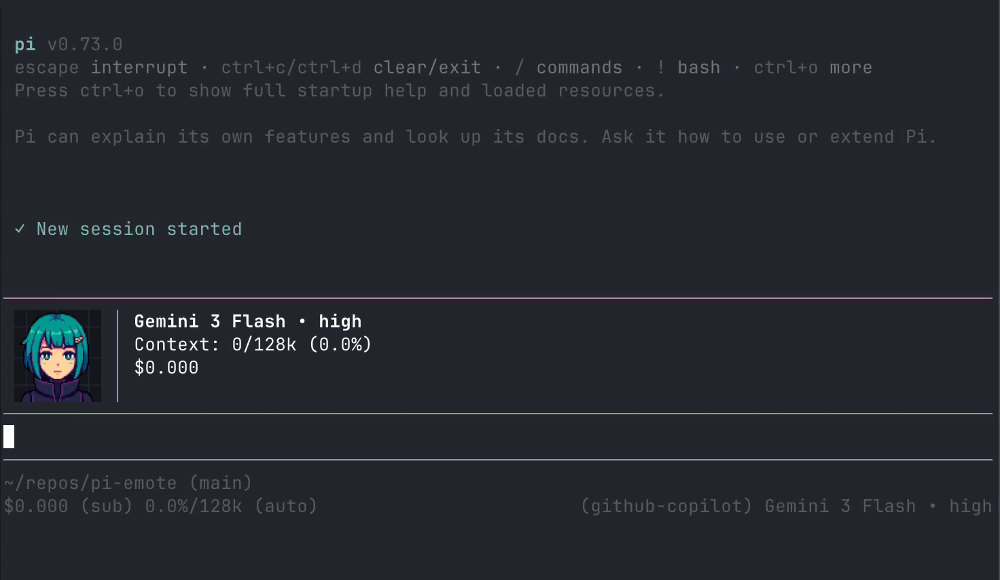

# CGx's pi-emote

> **Currently looking to expand the emotes gallery!** If you have an emote set you'd like to submit, please make a PR!

Animated pixel-art emote that lives in the top-right corner of your pi TUI session. Reacts to what the agent is doing — thinking, talking, reading, writing, using tools, etc.



Supports Kitty, iTerm2, and ASCII rendering.

## Gallery

Community-contributed emote sets. [Submit yours via PR!](#custom-emotes)

| Avatar | Name | Contributor |
|--------|------|-------------|
|  | `default` | [@cgxeiji](https://github.com/cgxeiji) |
| `(^ ◡ ^)/` | `ascii` | [@cgxeiji](https://github.com/cgxeiji) |
|  | `aza_choi` | [@shennguyenrs](https://github.com/shennguyenrs) |
|  | `aza_choi_nobg` | [@shennguyenrs](https://github.com/shennguyenrs) |

## Install

```bash
pi install git:github.com/cgxeiji/pi-emote
```

## States

| State | Trigger |
|-------|---------|
| hi | Session start |
| idle | Nothing happening (blinks occasionally) |
| think | Reasoning tokens streaming |
| talk | Text response streaming |
| read | `read` tool / reading tool output |
| write | `write` or `edit` tool |
| tool | Any other tool |
| success | Successful tool execution |
| failure | Failed tool execution |
| compact | Context compaction |

## Config

Drop a `config.json` in one of these paths (highest priority wins):

- `~/.pi/agent/extensions/pi-emote/config.json` — your global prefs
- `.pi/extensions/pi-emote/config.json` — project override

Only include what you want to change:

```json
{
  "size": 12,
  "emotes": [
    { "model": "*claude*", "emote-set": "my-avatar" }
  ]
}
```

See `config.json` in the extension root for all defaults.

### Terminal renderer overrides

Image protocol auto-detection doesn't always get it right (especially in multiplexers). Override per terminal:

```json
{
  "terminals": [
    { "match": "tmux", "render": "kitty" }
  ]
}
```

Render values: `"kitty"`, `"iterm2"`, `"ascii"`. Only include terminals you want to override — the rest keep their defaults. See `AGENTS.md` for the full list of detected terminal names.

## Custom Emotes

Emote sets live in `emotes/<set-name>/` with PNG frames per state:

```
emotes/my-avatar/
├── idle/*.png
├── think/*.png
├── talk/*.png
├── read/*.png
├── write/*.png
├── tool/*.png
└── ...          # hi, success, failure, compact
```

Not all states are required. Missing ones just won't animate.

### Where to put them

pi-emote searches in order:

1. `.pi/extensions/pi-emote/emotes/<name>/` (project)
2. `~/.pi/agent/extensions/pi-emote/emotes/<name>/` (user)
3. Extension built-in → falls back to `default`

### Map models to sets

Glob patterns against model ID, last match wins:

```json
{
  "emotes": [
    { "model": "*", "emote-set": "default" },
    { "model": "*claude*", "emote-set": "my-avatar" },
    { "model": "*haiku*", "emote-set": "haiku-avatar" }
  ]
}
```

In this example, `claude` models use `my-avatar`, but `haiku` ones use `haiku-avatar`.
See `emotes/default/emotes.json` for per-set frame config (blink frames, talk weights).

## License

MIT
